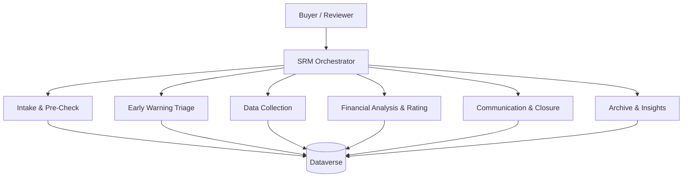

# Agent Topology and Handoff Contracts

## Scope and traceability

One SRM Orchestrator and six connected specialist agents, as approved in the
[implementation plan](./planning/implementation-plan.md) (Copilot Studio agents). Each agent has
`instructions.md`, `topics.md` and `knowledge.md` under [agents/](../agents/). Requirement IDs
cited are those already allocated in [06-agent-flows-and-actions.md](./06-agent-flows-and-actions.md)
and [03-model-driven-app.md](./03-model-driven-app.md); other areas are cited by slide until the
catalog (`10-deck-traceability.md`) allocates IDs.

| Agent | Folder | Owns | Source slides | Build status |
|---|---|---|---|---|
| SRM Orchestrator | [srm-orchestrator](../agents/srm-orchestrator/) | Routing, status Q&A, accountability rule | 1 | Empty agent exists; tool flow deployed, untested |
| Intake & Pre-Check | [intake-and-pre-check](../agents/intake-and-pre-check/) | Stage 1 | 2-5 | Empty agent exists; 3 flows deployed, 2 untested as tools |
| Data Collection | [data-collection](../agents/data-collection/) | Stage 2 | 4-7 | Spec only |
| Financial Analysis & Rating | [financial-analysis-and-rating](../agents/financial-analysis-and-rating/) | Stage 3 | 8-11 | Spec only |
| Communication & Closure | [communication-and-closure](../agents/communication-and-closure/) | Stage 4 | 6, 10, 12 | Spec only |
| Archive & Insights | [archive-and-insights](../agents/archive-and-insights/) | Stage 5, One-Page Summary | 13 onward | Spec only |
| Early Warning Triage | [early-warning-triage](../agents/early-warning-triage/) | Early Warning System | later slides | Spec only |

Slides 9 and later were read selectively when writing these specs. Re-read the cited slides
before building each agent, per `AGENTS.md`.

## Topology

Specialists never call each other. Every handoff goes through the orchestrator, so routing,
audit and the human gate are enforced in one place. Specialists are Copilot Studio connected
agents; their tools are agent flows (trigger **When an agent calls the flow**) and the
Dataverse connector.

## Shared context object

The orchestrator passes the same inputs to every specialist, so a specialist never has to ask
for what the orchestrator already knows.

| Field | Type | Meaning |
|---|---|---|
| `requestRef` | text | Request reference, e.g. `REQ-2026-024`. The key for every lookup. |
| `requestId` | GUID text | `mag_financialreviewrequestid`. |
| `userRole` | text | `Buyer`, `Reviewer`, `Manager` or `Auditor`. Drives masking and what may be written. |
| `intent` | text | What the user asked for, in one sentence. |

## Routing

| User intent | Route |
|---|---|
| Submit a request, look up a supplier profile, explain a pre-check result | Intake & Pre-Check |
| Where is a request, what stage, who is the reviewer | Orchestrator answers directly |
| Fetch Coface data, send or chase document requests, file replies | Data Collection |
| Extract statements, compute metrics, draft or explain a preliminary rating | Financial Analysis & Rating |
| Clarification emails, call summaries, closing email, system sync | Communication & Closure |
| Archive, lock, one-page summary, adverse news | Archive & Insights |
| Evaluate or act on an early warning | Early Warning Triage |

## Handoff contract

Every specialist returns the same envelope to the orchestrator:

| Field | Meaning |
|---|---|
| `status` | `done`, `needs-input` or `blocked` |
| `summary` | Short text the orchestrator can relay |
| `requestRef` | Echoed back |
| `recordUrl` | Link to the request in the app, when relevant |
| `needs` | What input is missing, when `status` is `needs-input` |

## Rules every agent follows

1. **Human accountability.** Agents prepare, extract, summarize, recommend, pre-fill and flag.
   Only a human reviewer confirms the final rating and can override an AI recommendation.
   Agents write to `mag_preliminaryrating` and narrative columns, never to Final Rating or
   Final Rating Confirmed. The one exception is the approved GSA reuse path, which copies a
   prior human-issued rating and is labeled as a reuse.
2. **Audit.** Every write that changes a request, a rating, a supplier or a communication
   adds a `mag_reviewaudittrail` row with the agent's name and actor type Agent.
3. **No invented policy.** Thresholds, rating mappings, retention periods and legal rules come
   from `mag_ratingconversionrule`, `mag_riskscoringrule` and environment variables. If a value
   is missing, the agent says so and stops.
4. **Mock systems.** GSA, Coface, D&B, eRFX and SharePoint are Dataverse tables. Agents say
   "GSA" or "Coface" in answers, and never claim a live external call.
5. **Role-sensitive data.** Adverse legal information is shown only to Reviewer and Manager
   roles. Auditors see audit evidence read-only. Buyers see outcomes, not legal detail.
6. **Fictional data only.**

## Open decisions

| Decision | Why open | Affects |
|---|---|---|
| Security role matrix for Buyer, Reviewer, Manager, Auditor | Roles are not built (plan todo 12). Agents must assume `userRole` is supplied. | All agents |
| Whether Early Warning Triage is a direct entry point or routed by the orchestrator | The plan lists it as a child of the orchestrator, but the deck's reminder behavior is time-driven. | Early Warning Triage |
| Rating mapping tables | Not in the source. `mag_ratingconversionrule` holds placeholders. | Data Collection, Communication & Closure |
