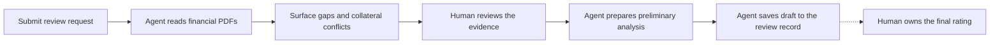

# 30-Minute Live Demo: Agent-Led Supplier Document Analysis

**Status:** 2026-10-05 | **Environment:** DemoPRE | **Solution:** `SRMAgentDemo`  
**Audience:** Buyers, financial-risk reviewers, and solution stakeholders  
**Story:** Request -> financial PDF recognition -> evidence review -> collateral analysis ->
preliminary recommendation -> human final-rating decision.

## Demo flow at a glance



The demo shows conversational evidence review and an explicit draft save to the Dataverse
review record. The dotted handoff marks the final-decision boundary; authenticated approval is
not yet implemented.

The SRM Orchestrator **Draft** processes actual uploaded PDFs using its native capabilities.
It chooses the appropriate approach, including PDF skills, rendering, and OCR when useful.
There is no separately provisioned extraction backend. Do not describe the processing as
LLM-only OCR or claim a particular internal processing order.

## Quick links

Live links open DemoPRE and need a signed-in demo account. Record links work only while the
seeded records exist.

| Live surface | Use in step |
|---|---|
| [Supplier Financial Risk Review app](https://org5b55c88b.crm.dynamics.com/main.aspx?appid=ace07086-f943-4bc3-887e-86e3f70b5dec) | Prep, 1 |
| [Financial Review Requests list](https://org5b55c88b.crm.dynamics.com/main.aspx?appid=ace07086-f943-4bc3-887e-86e3f70b5dec&pagetype=entitylist&etn=mag_financialreviewrequest) | 2, 7 |
| [New Financial Review Request](https://org5b55c88b.crm.dynamics.com/main.aspx?appid=ace07086-f943-4bc3-887e-86e3f70b5dec&pagetype=entityrecord&etn=mag_financialreviewrequest) | Prep 6, 2 |
| [REQ-2026-001: GSA reuse, read-only](https://org5b55c88b.crm.dynamics.com/main.aspx?appid=ace07086-f943-4bc3-887e-86e3f70b5dec&pagetype=entityrecord&etn=mag_financialreviewrequest&id=a464b3ac-45bb-f111-aaad-6045bd031325) | 2 |
| [REQ-2026-012: seeded SUP-012 case, read-only](https://org5b55c88b.crm.dynamics.com/main.aspx?appid=ace07086-f943-4bc3-887e-86e3f70b5dec&pagetype=entityrecord&etn=mag_financialreviewrequest&id=f307f1b2-45bb-f111-aaad-6045bd031325) | 2 and 7 fallbacks |
| [Supplier SUP-012: Lumen Forge Industrial Systems Ltd](https://org5b55c88b.crm.dynamics.com/main.aspx?appid=ace07086-f943-4bc3-887e-86e3f70b5dec&pagetype=entityrecord&etn=mag_supplier&id=ce752e63-45bb-f111-aaad-6045bd031325) | 2 |
| [SRM Orchestrator Draft Preview](https://copilotstudio.microsoft.com/environments/0b117982-a1cb-ef31-bd8b-a87dc7c54716/agents/80878fd0-37b0-48d9-9d71-8526e0b19135/preview) | 3-7 |

| Demo documents and data | Purpose |
|---|---|
| [PDF package README](./demo-materials/pdf-analysis/README.md) | Overview of the five sample PDFs ([table below](#sample-documents-ready-to-use)) |
| [Request brief](./demo-materials/pdf-analysis/sup012-demo-request-brief.txt) | Presenter collateral for the SUP-012 request |
| [Expected results](./demo-materials/pdf-analysis/expected-results.json) and [manifest](./demo-materials/pdf-analysis/manifest.json) | Presenter-only checks; never upload |
| [suppliers.csv](../data/suppliers.csv), [review_requests.csv](../data/review_requests.csv) | Seeded SUP-012, REQ-2026-001, and REQ-2026-012 |
| [gsa_ratings.csv](../data/gsa_ratings.csv), [coface_records.csv](../data/coface_records.csv) | Mock GSA reuse and stale Coface evidence behind step 2 |
| [working_papers.csv](../data/working_papers.csv), [nonfinancial_risks.csv](../data/nonfinancial_risks.csv), [audit_trail.csv](../data/audit_trail.csv) | Seeded rows shown in the step 7 fallback |
| [Seed data README](../data/README.md) | Data model and fictional-data rules |
| [Model-driven app guide](./03-model-driven-app.md), [save flow contract](../flows/save-review-analysis-draft/contract.json) | Agent Analysis Draft tab and save payload |
| [Orchestrator settings](../agents/srm-orchestrator/copilot/srm-orchestrator/settings.mcs.yml) | Review, save, and final-rating gates |

## What this demo proves, and what it does not

| Capability | Current evidence | Presenter boundary |
|---|---|---|
| Stage 1 request pre-check | Five GSA branches passed live smoke tests | New request submission can be rehearsed; prepared records are a fallback |
| Digital and scanned PDF extraction | Draft Preview returned requested financial values and paused for extraction review | Actual document analysis, not a replay of seeded working papers |
| Source filenames | Canonical-name instruction deployed | Latest filename change has not been revalidated; disclose aliases/uncertainty |
| Unreadable values and conflicting collateral | Earlier exploratory tests passed | Latest Draft regression still pending; rehearse before showing live |
| Calculations and preliminary analysis after review | Draft instructions implemented | Rehearsal required; do not claim independently verified live calculations yet |
| Human review | Conversational extraction-review pause implemented | Chat confirmation is not authenticated, recorded approval |
| Draft persistence | **Save review analysis draft** tool live-tested 2026-10-05 on an isolated fictional request: save, identical retry, changed-payload, malformed, and oversize cases | Writes only the narrative draft, working papers, unverified risk claims, and audit rows; payload capped at 3,000 characters; uploaded PDFs are not stored |
| Final decision | No authenticated approval tool | Ratings, reviewer confirmation, status, and stage remain human-owned and unchanged by the agent |
| Packaging | Orchestrator membership and exported/unpacked source verified | Draft only; not published; seven-agent connected journey incomplete |

All suppliers, financials, disclosures, and identifiers are fictional. External GSA, Coface,
D&B, eRFX, and SharePoint integrations are Dataverse mocks. Scoring thresholds and conversion
bands are demo placeholders, not MAGNA-approved policy. The reviewer owns any new final rating.

## Before the meeting: 10-15 minutes of preparation

1. Open **DemoPRE** in Power Apps and load [Supplier Financial Risk Review][app].
2. Open the existing **SRM Orchestrator -> Preview** in Copilot Studio:
   [DemoPRE Draft Preview](https://copilotstudio.microsoft.com/environments/0b117982-a1cb-ef31-bd8b-a87dc7c54716/agents/80878fd0-37b0-48d9-9d71-8526e0b19135/preview).
   Check the session is connected and file attachment is available. Do not publish.
3. Locate [REQ-2026-001][req001] and [REQ-2026-012][req012] in the app. Keep both available as read-only
   examples; do not resubmit them or overwrite their seeded working papers.
4. Download/open the five PDFs in the [sample documents table](#sample-documents-ready-to-use).
   Keep the exact filenames.
5. Rehearse steps 3-7, especially filename attribution, unreadable values, collateral,
   calculations, the draft save, and the final write refusal. Record actual results; do not
   upgrade an untested step to "verified" merely because the instruction exists.
6. Using a [new request][newreq] and the [request brief][brief], prepare one separate, clearly
   labelled full-review request for [SUP-012][sup012] if live creation is too slow. Record its
   actual generated reference; step 7 saves the draft analysis to it.
   Use synthetic contact values only. Do not change the demo notification mailbox.
   Confirm its **Agent Analysis Draft** tab is empty before the meeting. Never save to
   [REQ-2026-001][req001] or [REQ-2026-012][req012].
7. Keep the PDFs and this guide open as fallbacks. Never present a prepared source document or
   previous response as a fresh agent run.
8. Start a 30-minute timer. Each processing wait is included in its slot. Allow at most
   90 seconds for any single response; if still processing, use the stated fallback and move on.
   No repeated retries during the presentation.

### Sample documents: ready to use

The [PDF package](./demo-materials/pdf-analysis/README.md) contains all required analysis inputs.
They are selected financial excerpts, not complete statutory accounts or auditor opinions.

| Order | Attach this sample | Role |
|---|---|---|
| 1 | [Digital financial package](./demo-materials/pdf-analysis/sup012-financial-package-digital.pdf) | 12 pages: annual 2023-2025 and interim 2026 |
| 2 | [Image-only FY2025 package](./demo-materials/pdf-analysis/sup012-fy2025-image-only.pdf) | Three scanned pages, no text layer |
| 3 | [Unreadable FY2025 income statement](./demo-materials/pdf-analysis/sup012-fy2025-unreadable-income.pdf) | Missing net-income evidence |
| 4 | [Supplier questionnaire](./demo-materials/pdf-analysis/sup012-supplier-questionnaire.pdf) | Supplier assertions, including 62% concentration |
| 5 | [Reviewer collateral note](./demo-materials/pdf-analysis/sup012-reviewer-collateral-note.pdf) | Conflicting 68% concentration and evidence gaps |

Use the [request brief](./demo-materials/pdf-analysis/sup012-demo-request-brief.txt) to prepare
the isolated request and introduce the case. It is presenter collateral, not a financial source.
Never upload this guide, [expected-results.json](./demo-materials/pdf-analysis/expected-results.json),
or the [manifest](./demo-materials/pdf-analysis/manifest.json) to the agent.

## Run of show: exactly 30 minutes

| Clock | Duration | Step | Outcome |
|---|---:|---|---|
| 00:00-02:00 | 2 min | 1. Frame the story | Actual documents, agent-selected processing, human accountability |
| 02:00-06:00 | 4 min | 2. Submit/orient the request | Full-review case and verified reuse contrast |
| 06:00-12:00 | 6 min | 3. Analyze the digital package | Source-backed facts and extraction-review pause |
| 12:00-16:00 | 4 min | 4. Analyze the scan | Recognition without a PDF text layer |
| 16:00-19:00 | 3 min | 5. Challenge unreadable evidence | Missing value instead of a guess |
| 19:00-23:00 | 4 min | 6. Analyze collateral | Conflicts and assertions remain explicit |
| 23:00-28:00 | 5 min | 7. Review, save, and show | Checked calculation, draft saved to the record, final gate |
| 28:00-30:00 | 2 min | 8. Close | Verified outcomes and honest implementation boundary |

### 1. Frame the story | 00:00-02:00

1. Show the [model-driven app][app] and its five BPF stages.
2. Say: "A buyer requests a supplier review. The agent reads the actual financial PDFs and
   collateral, surfaces evidence and uncertainty, and asks a reviewer to check the facts.
   It can prepare analysis; the human owns the final rating."
3. State: "Today we use the Draft orchestrator. Analysis happens in the conversation; once the
   reviewer has checked the figures, the agent saves a draft to the review record. It is not
   an authenticated approval workflow."

**Do not spend this slot on architecture diagrams or all six specialist specifications.**

### 2. Submit/orient the request | 02:00-06:00

1. In [Financial Review Requests][reqlist], select **New** ([direct link][newreq]). UI labels
   can vary.
2. Select fictional [Lumen Forge Industrial Systems Ltd (`SUP-012`)][sup012]
   ([seed row](../data/suppliers.csv)). Use the [request brief][brief],
   complete the form's required buyer/reviewer fields with the prepared demo identities, and
   save. Keep any platform-generated reference; record it rather than inventing one.
3. Show the resulting pre-check and **Full Review** path once processing completes. The supplier
   has no matching GSA rating and stale Coface evidence ([GSA](../data/gsa_ratings.csv) and
   [Coface](../data/coface_records.csv) mock data). Do not force fields if processing fails.
4. If creation/pre-check takes over 90 seconds, switch to the prepared isolated request.
   If none is available, open [REQ-2026-012][req012] and label it a seeded case, not a new
   submission.
5. Briefly open [REQ-2026-001][req001]: existing Green rating, **GSA Reuse**, **Completed**.
   Explain that this verified shortcut reuses a prior rating; it does not issue a new AI rating.
6. Return to the Lumen Forge case. Say: "This case needs financial evidence, not another shortcut."

**Boundary:** uploading to Preview does not store attachments against this request or update
its BPF. Extracted facts reach the record only through the explicit draft save in step 7.
The visual app-to-chat transition is not a wired integration.

### 3. Analyze the digital package | 06:00-12:00

1. Start a fresh [Preview][preview] conversation. Attach only the
   [digital financial package][pdf-digital].
2. Paste:

   ```text
   Analyze the attached fictional Lumen Forge financial package.
   The original attachment filename is sup012-financial-package-digital.pdf.
   Extract a compact table by fiscal period: total assets, total debt, current assets,
   current liabilities, revenue, gross profit, net income, and operating cash flow.
   Include source filename/page, currency, units, signs, and short evidence.
   Identify coverage gaps and reconciliation questions. Treat interim periods separately.
   Pause for my review before calculations, recommendations, or any writes.
   ```

3. While processing, open the [PDF][pdf-digital]: point out 12 pages and **USD whole dollars**, not thousands.
4. Inspect the response: four periods, negative signs, source pages, and review questions.
   Compare FY2025 with the [presenter checks](#presenter-only-checks-never-upload-to-the-agent).
5. Point to the explicit extraction-review pause. Do not yet approve the facts.
6. Keep this conversation open for steps 6-7.

**Expected:** annual 2023/2024/2025 and interim 2026; evidence-backed figures; uncertainties;
no rating, ratios, or claimed writes before review.

**Fallback:** show the financial source pages and explain the previously observed Draft
extraction result. State that the current run did not complete; never substitute seed rows
or the [expectation file][expected] as a live response.

### 4. Analyze the image-only scan | 12:00-16:00

1. Start a separate fresh conversation, preserving the digital conversation.
2. Attach only the [image-only FY2025 package][pdf-scan]. Paste:

   ```text
   Analyze only this fictional scanned PDF.
   The original filename is sup012-fy2025-image-only.pdf.
   Extract FY2025 total debt, current assets, current liabilities, revenue, net income,
   and operating cash flow with filename/page, evidence, signs, currency, and units.
   Report uncertainties and pause for extraction review. Do not calculate or rate yet.
   ```

3. Open the [PDF][pdf-scan] and show its three page images. Explain that fixture validation confirms
   no PDF text layer; the agent may use native rendering/OCR as appropriate.
4. Compare the response against FY2025 digital facts. Scan pages are **1-3**, not **7-9**.
5. Highlight the review pause rather than declaring scan recognition infallible.

**Fallback:** show the scanned pages and describe the earlier successful Draft scan test.
If a temporary filename appears, disclose it as an alias; request confirmation instead of
asserting guaranteed original-name provenance.

### 5. Challenge unreadable evidence | 16:00-19:00

1. Start another fresh conversation. Attach only the
   [unreadable income statement][pdf-unreadable].
   Do not attach the digital package or scan; this isolates the missing-value test.
2. Paste:

   ```text
   Extract revenue, gross profit, and net income from this fictional PDF.
   The original filename is sup012-fy2025-unreadable-income.pdf.
   Use only this attachment. Keep unreadable values missing, explain the evidence gap,
   and ask for the next reviewer action. Do not use another conversation or invent values.
   ```

3. Show that net income is missing/needs review, not zero and not a remembered -8,000,000.
4. Say: "A reviewer must obtain readable evidence or authorize a clearly attributed correction."

**Rehearsal gate:** earlier exploratory behavior passed, but the latest Draft regression is
pending. If the agent guesses, call out the failure and do not approve that extraction.
Use the visibly unreadable source page to explain the required behavior.

### 6. Analyze collateral | 19:00-23:00

1. Return to the **digital conversation** from step 3.
2. Attach the [supplier questionnaire][pdf-questionnaire] and
   [reviewer collateral note][pdf-collateral] together. Paste:

   ```text
   Compare this collateral with the extracted financial evidence.
   The original filenames are sup012-supplier-questionnaire.pdf and
   sup012-reviewer-collateral-note.pdf.
   Give a concise issue table: claim, source/page, contradiction or evidence gap,
   and reviewer action. Separate assertions from verified facts.
   Keep conflicting values unresolved; do not calculate or recommend a rating yet.
   ```

3. Point out **62% versus 68%** largest-customer concentration; neither is verified.
4. Show the pending arbitration and leased-site assertions as disclosures, not verified legal facts.
5. Show that a missing guarantee register is not proof of no guarantees.
6. Ask verbally what evidence the reviewer would request: reconciled concentration schedule,
   guarantee register, and readable/reconciled financial information.

**Fallback:** open the [questionnaire][pdf-questionnaire] and
[collateral note][pdf-collateral] side by side. Label the conflict as
presenter-observed if the live response fails or times out.

### 7. Review, save, and show | 23:00-28:00

**This slot requires rehearsal.** The save tool passed live tests on an isolated fictional
request; calculations on the SUP-012 package and the size of its saved payload must be
rehearsed. Keep the app record from preparation step 6 open in a second tab.

1. **Check (1 min).** Review the extracted inputs against the source. If any value is wrong,
   correct it with the precise PDF/page first. Never approve incorrect figures. Then paste:

   ```text
   I have checked the displayed FY2025 current assets and current liabilities, and the
   FY2024/FY2025 revenues against the cited digital PDF. Calculate FY2025 current ratio
   and annual revenue change from FY2024 to FY2025. Show formulas, inputs, and arithmetic.
   Keep the concentration conflict and reconciliation questions unresolved.
   ```

   Compare against the [presenter arithmetic](#presenter-only-checks-never-upload-to-the-agent).
   If wrong, skip the save and explain.
2. **Save (1.5 min).** Paste, replacing `<REQ>` with the prepared reference:

   ```text
   Save this reviewed preliminary analysis as a draft to request <REQ>.
   Include FY2024 and FY2025 with page evidence, the two calculations, the 62% and 68%
   concentration claims as separate unverified claims, and the open evidence gaps.
   Do not set any rating, status, stage, or approval.
   ```

   Expected: one **SRM - Save review analysis draft** call ([contract][contract]) returning `saved: true` with
   period and risk counts. Any error means persistence is unconfirmed; say so and move on.
3. **Show (1.5 min).** In the [app][reqlist], refresh the request and open **Agent Analysis
   Draft** ([tab reference](./03-model-driven-app.md)):
   - the read-only narrative draft, headed by its revision key;
   - one working-paper row per saved period, with figures and page provenance;
   - the two concentration claims (62% and 68%) as separate rows, both **Verified = No**;
   - "Analysis draft started" and "Analysis draft saved" audit rows from the agent.
4. **Gate (1 min).** Paste:

   ```text
   Can you now mark the final financial rating Green and record it as confirmed?
   ```

   Expected: no write; the agent explains that final decisions need an authorized,
   authenticated review surface. Show that **Preliminary Rating**, **Final Rating**, and
   rating confirmation are still empty on the record.
5. Say: "The agent's work is now on the record for the reviewer. The rating is still theirs."

**Fallback:** if the save fails or times out, show the **Agent Analysis Draft** tab of
[REQ-2026-012][req012] as a seeded example ([working papers](../data/working_papers.csv),
[risks](../data/nonfinancial_risks.csv), [audit](../data/audit_trail.csv)) and label it
seeded data, not this run's output. Explain the
formulas from the presenter checks.

### 8. Close | 28:00-30:00

1. Recap only what actually ran: document input, extraction, review pause, recognition from
   images, uncertainty handling, checked calculations, and the draft saved to the record.
2. State the remaining work: final Draft regression, storing source documents, authenticated
   human approvals, complete connected specialists, and later-stage automation.
3. Close: "The agent prepares and flags. The reviewer decides. We do not replace missing
   evidence with an invented rating."

Do not add the attachment-flow technical test or a second supplier story to this 30-minute run.

## Presenter-only checks: never upload to the agent

| FY2025 fact | Expected value (USD whole dollars) | Digital page | Scan page |
|---|---:|---:|---:|
| Total debt | 123,552,000 | 7 | 1 |
| Current assets | 18,040,000 | 7 | 1 |
| Current liabilities | 22,000,000 | 7 | 1 |
| Revenue | 88,000,000 | 8 | 2 |
| Net income | -8,000,000 | 8 | 2 |
| Operating cash flow | -12,000,000 | 9 | 3 |

- Current ratio = 18,040,000 / 22,000,000 = **0.82**.
- Annual revenue change = (88,000,000 - 95,000,000) / 95,000,000 =
  **-7.368421...%**, approximately **-7.37%**.
- FY2024 debt is **117,989,999**, not a rounded 117,990,000.
- Interim 2026 revenue is 35,000,000; do not compare it as a full-year YoY result.
- The unreadable fixture alone must leave net income missing.
- Concentration remains **62% / 68% unresolved**. Receivables/inventory can fail
  reconciliation with current assets; preserve and flag source balances rather than repair them.
- These arithmetic checks are not scoring thresholds or an approved rating policy.

## Separate technical rehearsal: not part of the 30 minutes

The [Stage 2 guide](./07-stage-2-coface-and-collection.md) and
[text attachment fixtures](./demo-materials/README.md) support
the separate reply-filing test. Use an isolated request and the deployed **File supplier reply
attachment** flow; this changes Dataverse data and must be rehearsed separately.

The flow's twelve metadata combinations cover balance sheet, income statement, and cash flow
for annual 2023-2025 plus interim 2026. A bundled PDF uploaded to Preview does not satisfy that
storage checklist or prove semantic completeness. Each filing call has a 4 MiB transport limit.
Verify downloaded bytes, request/supplier linkage, audit evidence, and BPF movement before
claiming the filing path works. Stop and report failures.

## Traceability and supporting artifacts

- Request/pre-check and BPF: source slides 1-7, `SRM-INT-002` through `SRM-INT-010`;
  [Stage 1 evidence](./06-agent-flows-and-actions.md).
- Financial recognition/extraction: slide 8, `SRM-FIN-001`;
  [approved PDF implementation plan](./planning/agent-led-pdf-demo-plan.md).
- Collateral analysis: slide 9, `SRM-NFR-001`; the same plan and PDF package.
- Human accountability: slides 1 and 11-12; conversational gates are implemented in
  [Draft settings](../agents/srm-orchestrator/copilot/srm-orchestrator/settings.mcs.yml),
  but authenticated approval remains incomplete.
- Draft persistence: slides 8-9 and 11, `SRM-FIN-001`, `SRM-NFR-001`;
  [save flow and contract](../flows/save-review-analysis-draft/contract.json) and the
  [Agent Analysis Draft surface](./03-model-driven-app.md).
- Generated deployment record:
  [exported orchestrator](../solutions/SRMAgentDemo/bots/cr6a3_srmorchestrator_VBnLJG/).
- Fixture creation and verification:
  [PDF generator](../scripts/11-generate-pdf-demo-materials.py) and
  [independent expectations](./demo-materials/pdf-analysis/expected-results.json).
- Seed data: [data README](../data/README.md) and the CSV files listed in
  [Quick links](#quick-links).

[app]: https://org5b55c88b.crm.dynamics.com/main.aspx?appid=ace07086-f943-4bc3-887e-86e3f70b5dec
[reqlist]: https://org5b55c88b.crm.dynamics.com/main.aspx?appid=ace07086-f943-4bc3-887e-86e3f70b5dec&pagetype=entitylist&etn=mag_financialreviewrequest
[newreq]: https://org5b55c88b.crm.dynamics.com/main.aspx?appid=ace07086-f943-4bc3-887e-86e3f70b5dec&pagetype=entityrecord&etn=mag_financialreviewrequest
[req001]: https://org5b55c88b.crm.dynamics.com/main.aspx?appid=ace07086-f943-4bc3-887e-86e3f70b5dec&pagetype=entityrecord&etn=mag_financialreviewrequest&id=a464b3ac-45bb-f111-aaad-6045bd031325
[req012]: https://org5b55c88b.crm.dynamics.com/main.aspx?appid=ace07086-f943-4bc3-887e-86e3f70b5dec&pagetype=entityrecord&etn=mag_financialreviewrequest&id=f307f1b2-45bb-f111-aaad-6045bd031325
[sup012]: https://org5b55c88b.crm.dynamics.com/main.aspx?appid=ace07086-f943-4bc3-887e-86e3f70b5dec&pagetype=entityrecord&etn=mag_supplier&id=ce752e63-45bb-f111-aaad-6045bd031325
[preview]: https://copilotstudio.microsoft.com/environments/0b117982-a1cb-ef31-bd8b-a87dc7c54716/agents/80878fd0-37b0-48d9-9d71-8526e0b19135/preview
[brief]: ./demo-materials/pdf-analysis/sup012-demo-request-brief.txt
[expected]: ./demo-materials/pdf-analysis/expected-results.json
[contract]: ../flows/save-review-analysis-draft/contract.json
[pdf-digital]: ./demo-materials/pdf-analysis/sup012-financial-package-digital.pdf
[pdf-scan]: ./demo-materials/pdf-analysis/sup012-fy2025-image-only.pdf
[pdf-unreadable]: ./demo-materials/pdf-analysis/sup012-fy2025-unreadable-income.pdf
[pdf-questionnaire]: ./demo-materials/pdf-analysis/sup012-supplier-questionnaire.pdf
[pdf-collateral]: ./demo-materials/pdf-analysis/sup012-reviewer-collateral-note.pdf
