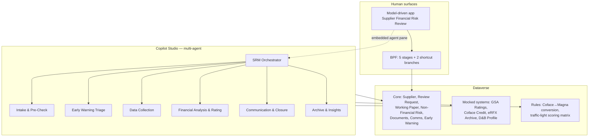

# Supplier Risk Management (SRM) Agent Demo — Implementation Plan

## Problem

MAGNA's Supplier Financial Review process (source deck: *FY27 MAGNA - SRM Agent Use Case.pptx*) is
a five-step manual workflow spanning SharePoint, GSA (procurement), Coface (third-party credit) and
eRFX (archive + supplier profile + early warning). The deck estimates the manual workload split as:

| Step | Name | Manual workload | AI opportunity |
|---|---|---|---|
| 1 | Request / Pre-Check | 10% | High automation |
| 2 | Information Collection | 30% | Very high impact |
| 3 | Analysis / Rating | 35% | Top priority |
| 4 | Communication | 15% | Medium-high |
| 5 | Archiving / Dashboard | 10% | High control value |

Two cross-cutting capabilities are also described: the **Supplier One-Page Summary** and the
**Early Warning System**.

## Proposed approach

Build a **self-contained Power Platform demo kit** that re-implements this process on Dataverse:

- **Dataverse** as the single system of record. GSA, Coface, D&B, eRFX and SharePoint are *mocked as
  Dataverse tables* with seeded sample data, so the demo runs in any environment with no external
  credentials.
- **A model-driven app** ("Supplier Financial Risk Review") as the human surface: forms, views,
  dashboards, and the One-Page Summary.
- **One business process flow** with 5 stages mirroring the deck, including the two shortcut
  branches (GSA rating reuse, Coface fast-track).
- **7 Copilot Studio agents** — one orchestrator plus six connected child agents, each owning a
  specific slice of the BPF. Each agent ships with paste-ready instructions, topic specs, knowledge
  sources and an action/tool inventory.
- **Authoring-ready artifacts**: JSON schema definitions, PAC CLI / Web API provisioning scripts,
  CSV seed data, and a step-by-step build guide for the parts that must be authored in the maker
  portals (app, BPF, agents).

Governance principle carried over from the deck: *AI prepares, pre-fills and flags; the human
reviewer remains accountable for the final financial rating.* Every agent writes an audit-trail row
and every rating is reviewer-confirmable with an override.

---

## Target architecture



## Dataverse data model (publisher prefix `mag`)

**Core process tables**
1. `mag_supplier` — supplier master (legal name, DUNS / no-DUNS flag, address, country, region,
   website, business category, manufacturing zone, Magna division, annual eRFX spend, has-active-spend
   flag, current Magna rating, current Coface score).
2. `mag_financialreviewrequest` — **BPF host table**. Request ref (autonumber), supplier, buyer,
   reviewer, division, status, review path, GSA pre-check result, Coface score / tier / data-age /
   within-18-months, AI preliminary rating, AI narrative draft, final Magna rating, rating date,
   expiry, remarks, reviewer-override flag, source early warning, archive folder link.
3. `mag_documentrequest` — outreach tracking (type, sent on, day-3 reminder, day-7 escalation,
   response received, status).
4. `mag_supplierdocument` — supplier-submitted files (doc type, fiscal year, period, OCR status,
   file column, archive subfolder, duplicate flag, metadata tags).
5. `mag_financialworkingpaper` — per fiscal year/interim: raw line items plus derived leverage,
   liquidity, gross margin, asset turnover, YoY deltas, and an anomaly-flag multi-select.
6. `mag_nonfinancialriskitem` — litigation, arbitration, off-balance-sheet guarantees, customer
   concentration, owned vs leased assets, management turnover, penalties; with severity, source URL,
   event date.
7. `mag_communicationlog` — inbound/outbound email, call transcript + AI summary, language and
   translation.
8. `mag_earlywarning` — eRFX Early Warning entry: description, rumour source, potential impact,
   affected volume, AI risk tags, AI materiality (High/Medium/Low), prompt behaviour, linked review
   request, resolution status, 24h-reminder flag.
9. `mag_reviewaudittrail` — the "tracking file ledger": action, actor (human or named agent),
   timestamp, system touched, details.

**Mocked external systems**
10. `mag_gsaratingrecord` — GSA procurement ratings by DUNS (rating, remarks, rating date, expiry,
    mandatory re-review flag) — drives the four pre-check outcomes.
11. `mag_cofacecreditrecord` — Coface API mock (score 1–10, risk tier, payment track record, negative
    alerts, recommended credit limit, assessment data date, report link).
12. `mag_dnbprofile` — D&B / public registry mock for Step 1 field auto-completion and for the
    One-Page Summary company profile.
13. `mag_archiverecord` — eRFX archive mock: folder ID `[DUNS] - Legal Name - Review Ref`, one of the
    four fixed subfolders, item type, locked flag, version, searchable metadata.
14. `mag_adversenewsevent` — scheduled adverse-news monitoring results (category, severity, release
    date, source hyperlink).

**Rules / output tables**
15. `mag_ratingconversionrule` — Coface score band → Magna rating + credit-limit guidance.
16. `mag_riskscoringrule` — traffic-light matrix: metric, operator, threshold, points, dimension.
17. `mag_supplieronepagesummary` — generated summary: company profile with source attribution, risk
    metrics panel, historical trend interpretation, adverse-event digest, alert banner, version,
    generated on.

## Business process flow — `Supplier Financial Review`

| Stage | Steps | Exit / branch |
|---|---|---|
| 1. Request & Pre-Check | DUNS entered, D&B auto-fill confirmed, GSA pre-check result | Branch on GSA result |
| 2. Information Collection | Coface retrieved, doc request sent, reminders, docs received | |
| 3. Analysis & Rating | Working paper complete, metrics computed, non-financial risks logged, AI preliminary rating | |
| 4. Communication & Decision | Clarifications closed, final rating confirmed by reviewer, buyer notified | |
| 5. Archiving & Publication | Archive complete, locked, GSA push-back, One-Page Summary refreshed | |

Branches:
- **Shortcut A — GSA reuse**: pre-check = *Valid active rating*, no mandatory re-review → auto-fill
  rating, status Completed, jump Stage 1 → Stage 5. Buyer + reviewer notified; no supplier contact.
- **Shortcut B — Coface fast-track**: Coface rating is based on data ≤18 months old → apply the
  conversion rule set to derive the Magna rating, jump Stage 2 → Stage 4.
- **Full review**: no GSA match / expired / mandatory re-review / no DUNS / no valid Coface → all
  five stages.

## Model-driven app — `Supplier Financial Risk Review`

- **Areas**: Review Desk, Suppliers, Early Warnings, Reference Data, Archive.
- **Views**: My Open Reviews, Awaiting Supplier Documents, Pending Rating Decision, Fast-Track
  (Coface), Auto-Closed (GSA Reuse), Completed This Quarter, High-Materiality Early Warnings.
- **Forms**: Review Request main form with BPF and tabs (Request, Pre-Check, Coface, Working Paper,
  Non-Financial, Communications, Archive, Audit); Supplier form with a One-Page Summary tab.
- **Dashboards**: Risk Team Dashboard (rating mix, path split, cycle-time/aging, workload by
  reviewer) and Supplier Risk Dashboard (traffic-light metrics, rating trend, adverse-news banner).

## Copilot Studio agents (1 orchestrator + 6 connected)

| # | Agent | Owns | Key capabilities from deck |
|---|---|---|---|
| 1 | **SRM Orchestrator** | Routing + status Q&A | Entry point, delegates to child agents, answers "where is REQ-1042", enforces the human-accountability rule |
| 2 | **Intake & Pre-Check** | Step 1 | D&B field auto-completion, cross-GSA DUNS pre-check (4 outcomes), no-DUNS bypass, auto-close reuse path, buyer/reviewer notifications, ledger entry |
| 3 | **Early Warning Triage** | Early Warning System | Risk-tag suggestion, materiality scoring vs. rating/score/spend, mandatory vs. soft prompt, pre-populated review request + direct link, bidirectional sync, 24h reminder |
| 4 | **Data Collection** | Step 2 | Coface lookup by DUNS, fuzzy-match shortlist for no-DUNS, colour-coded risk brief, checklist email (quant + non-financial questionnaire), day-3/day-7 cadence, auto-filing of replies |
| 5 | **Financial Analysis & Rating** | Step 3 | Statement extraction into the working paper, pre-built metric formulas, anomaly flags, public non-financial risk compilation, traffic-light matrix, preliminary rating + narrative draft |
| 6 | **Communication & Closure** | Step 4 | Clarification emails on detected inconsistencies, call transcription + summary binding, translation, closing email to buyer, one-click cross-system sync and GSA push-back |
| 7 | **Archive & Insights** | Step 5 + One-Pager | Standardised folder + 4 subfolders, document classification and auto-filing, dedupe, completeness check, read-only lock, metadata, One-Page Summary generation and adverse-news monitoring |

Each agent gets: instructions, trigger/topic specs, Dataverse knowledge scope, action inventory
(agent flows / Dataverse connector operations), and explicit handoff contracts with the orchestrator.

## Deliverable structure

```
/docs        00-overview, 01-architecture, 02-data-model, 03-bpf, 04-model-driven-app,
             05-agents/(topology + 7 agent specs), 06-agent-flows-and-actions,
             07-security-roles, 08-build-guide, 09-demo-script, 10-deck-traceability
/schema      tables/*.json, choices.json, relationships.json
/scripts     01-create-solution.ps1, 02-create-tables.ps1, 03-import-sampledata.ps1, 99-teardown.ps1
/data        suppliers.csv, gsa_ratings.csv, coface_records.csv, dnb_profiles.csv,
             review_requests.csv, working_papers.csv, nonfinancial_risks.csv,
             early_warnings.csv, adverse_news.csv, rating_conversion_rules.csv,
             risk_scoring_rules.csv
/agents      <agent>/instructions.md, <agent>/topics.md, <agent>/knowledge.md
/flows       <flow-name>/flow.json, <flow-name>/definition.json, connection-references.json,
             environment-variables.json (deployed code-first via the Dataverse API)
/solutions   SRMAgentDemo/ (exported and unpacked from DemoPRE; generated, not hand-edited)
README.md
```

## Sample data design

~12 suppliers engineered to exercise every path:
- 3 with a valid active GSA rating (auto-close shortcut)
- 2 with an expired GSA rating
- 2 with a mandatory re-review trigger despite a valid rating
- 2 with no GSA match but a fresh Coface score (fast-track)
- 2 with no DUNS (fuzzy-match + full manual review + disclaimer text)
- 1 distressed supplier with 3 years of deteriorating financials, live arbitration, 60%+ customer
  concentration, leased plants — the hero "full review + red rating" narrative, also carrying an
  open Early Warning record.

## Todos

1. `scaffold-repo` — create folder structure, README, publisher/prefix and naming conventions.
2. `deck-traceability` — extract the deck into a structured requirements map (slide → capability → artifact).
3. `data-model-spec` — write `02-dataverse-data-model.md` with every table, column, choice set and relationship.
4. `schema-json` — machine-readable `schema/tables/*.json`, `choices.json`, `relationships.json`.
5. `bpf-spec` — 5 stages, steps, data steps, branch conditions, stage-gate rules.
6. `app-spec` — sitemap, forms, views, charts, dashboards, One-Page Summary surface.
7. `agent-topology` — orchestrator/child topology, handoff contracts, shared context object.
8. `agent-specs` — 7 per-agent instruction + topic + knowledge files.
9. `actions-inventory` — agent flows / Dataverse actions each agent invokes, with inputs and outputs.
10. `sample-data` — CSV seed files covering all branch paths.
11. `provisioning-scripts` — PAC CLI + Web API PowerShell scripts for solution, tables and data import.
12. `security-roles` — Buyer, Risk Reviewer/Analyst, Risk Manager, Auditor (read-only, masked adverse legal data).
13. `build-guide` — ordered manual build steps for app, BPF and agents in the maker portals.
14. `demo-script` — three runnable demo narratives plus a 90-second executive version.
15. `validate` — self-review pass: cross-check every deck capability is covered, verify scripts parse and CSV headers match the schema.

## Notes and considerations

- **Version sensitivity.** Copilot Studio multi-agent features (connected agents, agent flows,
  Dataverse knowledge) evolve quickly. The build guide will describe intent and configuration, with
  a note that exact menu paths may shift; agent instructions themselves are portable.
- **No environment yet.** Scripts will be written to target an environment URL supplied at run time;
  nothing is provisioned as part of this work unless you point me at an environment.
- **Branding.** Artifacts use neutral "Supplier Risk Management" naming with MAGNA as the demo
  narrative, so the kit can be re-pointed at another customer by editing the seed data and README.
- **Fictional data only.** All supplier names, DUNS numbers, financials and adverse events are
  synthetic; no real Coface, D&B or GSA data is used or embedded.
- **Solution source.** Hand-authored unpacked solution XML (`Entities/*.xml`, BPF XML, appmodule)
  remains out of scope. After each successful DemoPRE deployment, however, the unmanaged
  `SRMAgentDemo` solution is exported and unpacked into `solutions/SRMAgentDemo/` whenever the local
  source does not already represent the deployed state (see `AGENTS.md`, Solution Source
  Synchronization). *Changed 2026-09-28 at user request.*
- **Cloud flow generation.** All flows are Copilot Studio agent flows generated code-first:
  definitions in `flows/` are deployed as solution-aware `workflow` records (category 5,
  modernflowtype 1) through the Dataverse API
  into `SRMAgentDemo`, with connection references and environment variables, then pulled back via
  solution sync. Rules are in `AGENTS.md`, Cloud Flow Generation. *Decided 2026-09-28 at user
  request (research option 3).*
